# System Architecture - End-to-End Flow Diagram

## Complete System Flow with AI/NLP Layer

```mermaid
graph TB
    subgraph "Client Layer"
        USER[👤 End User<br/>WhatsApp Mobile App<br/>2.5B+ Global Users]
    end

    subgraph "Meta WhatsApp Business Cloud"
        META_API[📱 Meta WhatsApp Business API<br/>Graph API v18.0<br/>Enterprise Messaging Infrastructure]
        WEBHOOK_META[🔔 Meta Webhook Service<br/>Event Distribution<br/>Message Routing]
    end

    subgraph "Application Gateway & API Layer"
        LB[⚖️ Load Balancer<br/>AWS ALB / Nginx<br/>SSL Termination]
        WEBHOOK_CTRL[🎯 WebhookController<br/>REST API Endpoint<br/>POST /webhook<br/>GET /webhook/health]
        MSG_PARSER[📝 MessageParser<br/>JSON Deserialization<br/>Context Extraction]
    end

    subgraph "AI & Natural Language Processing Layer"
        NLP_ENGINE[🤖 AI/NLP Engine<br/>Intent Recognition<br/>Entity Extraction<br/>Sentiment Analysis]
        QUERY_UNDERSTANDER[🧠 Query Understanding Service<br/>Natural Language Understanding<br/>Contextual Analysis<br/>Intent Classification]
        RESPONSE_GENERATOR[💬 Natural Response Generator<br/>Human-Readable Formatting<br/>Contextual Response Building<br/>Personalization Engine]
    end

    subgraph "Business Logic & Orchestration Layer"
        MSG_SERVICE[📨 WhatsAppMessageService<br/>Message Orchestration<br/>Session Management<br/>State Coordination]
        MSG_PROCESSOR[⚙️ MessageProcessorService<br/>Stage Resolution<br/>Workflow Routing<br/>Processor Registry]
        LENDING_WORKFLOW[🏦 LendingWorkflowService<br/>State Machine Engine<br/>11-Stage Workflow<br/>Business Rule Engine]
        STAGE_PROCESSORS[🔀 Stage Processors<br/>OnboardingProcessor<br/>KYCProcessor<br/>EligibilityProcessor<br/>OfferProcessor<br/>DisbursalProcessor<br/>PostDisbursalProcessor]
    end

    subgraph "Data & Persistence Layer"
        USER_REPO[(👤 UserDetailsRepository<br/>User Profile<br/>Application Tracking<br/>Stage Management)]
        MSG_REPO[(💬 MessageRepository<br/>Message History<br/>Audit Trail<br/>Compliance Logging)]
        CHAT_REPO[(📋 ChatHistoryRepository<br/>Conversation Context<br/>Session Data<br/>Analytics)]
        CONFIG_REPO[(⚙️ ConfigPropertyRepository<br/>Dynamic Configuration<br/>Feature Flags<br/>Business Rules)]
    end

    subgraph "External Integrations & Services"
        CREDIT_BUREAU[📊 Credit Bureau API<br/>CIBIL / Experian / Equifax<br/>Real-time Credit Checks<br/>Risk Assessment]
        CORE_BANKING[🏛️ Core Banking System<br/>Account Management<br/>Transaction Processing<br/>Loan Disbursal]
        PAYMENT_GW[💳 Payment Gateway<br/>UPI / NEFT / RTGS<br/>Payment Processing<br/>Transaction Verification]
        DOC_VERIFY[📄 Document Verification Service<br/>OCR Processing<br/>KYC Validation<br/>Compliance Checks]
    end

    subgraph "Response & Delivery Layer"
        RESPONSE_BUILDER[📤 Response Builder<br/>Message Formatting<br/>Template Engine<br/>Rich Media Support]
        WHATSAPP_CLIENT[📱 WhatsAppApiClient<br/>Graph API Integration<br/>Message Delivery<br/>Read Receipts]
    end

    %% User Flow
    USER -->|"1. Sends Message<br/>Text/Media/Commands"| META_API
    META_API -->|"2. Webhook Event<br/>HTTPS POST<br/>JSON Payload"| WEBHOOK_META
    WEBHOOK_META -->|"3. Webhook Callback<br/>Event Notification"| LB
    LB -->|"4. Route Request<br/>Load Distribution"| WEBHOOK_CTRL
    WEBHOOK_CTRL -->|"5. Parse Payload<br/>Extract Message Data"| MSG_PARSER
    MSG_PARSER -->|"6. Message Context<br/>Structured Data"| MSG_SERVICE

    %% AI/NLP Processing Flow
    MSG_SERVICE -->|"7. Raw User Input<br/>Unstructured Text"| NLP_ENGINE
    NLP_ENGINE -->|"8. Intent & Entities<br/>Structured Understanding"| QUERY_UNDERSTANDER
    QUERY_UNDERSTANDER -->|"9. Contextual Query<br/>Enriched with Intent"| MSG_PROCESSOR

    %% Business Logic Flow
    MSG_PROCESSOR -->|"10. Resolve Current Stage<br/>State Machine Lookup"| LENDING_WORKFLOW
    LENDING_WORKFLOW -->|"11. Route to Stage Processor<br/>Business Logic Execution"| STAGE_PROCESSORS
    STAGE_PROCESSORS -->|"12. Process Business Rules<br/>Validate Input<br/>Update State"| LENDING_WORKFLOW

    %% Data Access Flow
    MSG_SERVICE -->|"13. Persist Message<br/>Audit Trail"| MSG_REPO
    MSG_SERVICE -->|"14. Save Chat History<br/>Session Context"| CHAT_REPO
    MSG_PROCESSOR -->|"15. Fetch User State<br/>Application Status"| USER_REPO
    LENDING_WORKFLOW -->|"16. Update User Stage<br/>Persist State Changes"| USER_REPO
    STAGE_PROCESSORS -->|"17. Load Configuration<br/>Business Rules"| CONFIG_REPO

    %% External Service Integration
    STAGE_PROCESSORS -.->|"18. Credit Check<br/>Eligibility Assessment"| CREDIT_BUREAU
    STAGE_PROCESSORS -.->|"19. Account Verification<br/>Disbursal Processing"| CORE_BANKING
    STAGE_PROCESSORS -.->|"20. Payment Processing<br/>Transaction Handling"| PAYMENT_GW
    STAGE_PROCESSORS -.->|"21. Document Verification<br/>KYC Processing"| DOC_VERIFY

    %% Response Generation Flow
    STAGE_PROCESSORS -->|"22. Business Data<br/>Structured Response Data"| RESPONSE_GENERATOR
    RESPONSE_GENERATOR -->|"23. Natural Language<br/>Human-Readable Format"| RESPONSE_BUILDER
    RESPONSE_BUILDER -->|"24. Formatted Message<br/>Template Applied"| WHATSAPP_CLIENT
    WHATSAPP_CLIENT -->|"25. Graph API Call<br/>Message Delivery"| META_API
    META_API -->|"26. Deliver to User<br/>WhatsApp Notification"| USER

    %% Feedback Loop
    USER_REPO -.->|"27. State Persistence<br/>Session Continuity"| MSG_PROCESSOR
    CHAT_REPO -.->|"28. Context Retrieval<br/>Conversation History"| NLP_ENGINE

    %% Styling
    classDef userLayer fill:#e1f5ff,stroke:#01579b,stroke-width:2px
    classDef metaLayer fill:#e8f5e9,stroke:#2e7d32,stroke-width:2px
    classDef apiLayer fill:#fff3e0,stroke:#e65100,stroke-width:2px
    classDef aiLayer fill:#f3e5f5,stroke:#6a1b9a,stroke-width:3px
    classDef businessLayer fill:#e3f2fd,stroke:#1565c0,stroke-width:2px
    classDef dataLayer fill:#fce4ec,stroke:#c2185b,stroke-width:2px
    classDef externalLayer fill:#fff9c4,stroke:#f57f17,stroke-width:2px
    classDef responseLayer fill:#e0f2f1,stroke:#00695c,stroke-width:2px

    class USER userLayer
    class META_API,WEBHOOK_META metaLayer
    class LB,WEBHOOK_CTRL,MSG_PARSER apiLayer
    class NLP_ENGINE,QUERY_UNDERSTANDER,RESPONSE_GENERATOR aiLayer
    class MSG_SERVICE,MSG_PROCESSOR,LENDING_WORKFLOW,STAGE_PROCESSORS businessLayer
    class USER_REPO,MSG_REPO,CHAT_REPO,CONFIG_REPO dataLayer
    class CREDIT_BUREAU,CORE_BANKING,PAYMENT_GW,DOC_VERIFY externalLayer
    class RESPONSE_BUILDER,WHATSAPP_CLIENT responseLayer
```



## AI/NLP Layer Detailed Flow

```mermaid
graph LR
    subgraph "AI/NLP Processing Pipeline"
        INPUT[📥 Raw User Input<br/>"I want to check my loan status"]
        
        STEP1[🔍 Step 1: Intent Recognition<br/>Classify user intent<br/>STATUS_QUERY]
        
        STEP2[📊 Step 2: Entity Extraction<br/>Extract entities<br/>loan_id, user_id]
        
        STEP3[🧠 Step 3: Context Enrichment<br/>Fetch relevant data<br/>Query Database]
        
        STEP4[💾 Step 4: Data Retrieval<br/>Loan Details<br/>Balance, EMI, Due Date]
        
        STEP5[🤖 Step 5: Natural Language Generation<br/>Convert to human-readable<br/>"Your loan balance is ₹4,85,000..."]
        
        OUTPUT[📤 Natural Response<br/>Human-friendly format]
    end

    INPUT --> STEP1
    STEP1 --> STEP2
    STEP2 --> STEP3
    STEP3 --> STEP4
    STEP4 --> STEP5
    STEP5 --> OUTPUT

    classDef aiStep fill:#f3e5f5,stroke:#6a1b9a,stroke-width:2px
    class INPUT,STEP1,STEP2,STEP3,STEP4,STEP5,OUTPUT aiStep
```

## System Components Overview

### 1. **Client Layer**
- End users interacting via WhatsApp mobile application
- 2.5B+ global user base
- Zero app download required

### 2. **Meta WhatsApp Business Cloud**
- Enterprise-grade messaging infrastructure
- Graph API v18.0 for message routing
- Webhook service for event distribution

### 3. **Application Gateway & API Layer**
- Load balancer for high availability
- Webhook controller for receiving messages
- Message parser for JSON deserialization

### 4. **AI & Natural Language Processing Layer** ⭐
- **NLP Engine**: Intent recognition, entity extraction, sentiment analysis
- **Query Understanding Service**: Natural language understanding, contextual analysis
- **Natural Response Generator**: Converts structured data to human-readable format

### 5. **Business Logic & Orchestration Layer**
- Message service for orchestration
- State machine engine for workflow management
- Stage processors for business rule execution

### 6. **Data & Persistence Layer**
- User details repository
- Message repository for audit trail
- Chat history for session management
- Configuration repository for dynamic rules

### 7. **External Integrations & Services**
- Credit bureau APIs for eligibility checks
- Core banking system for transactions
- Payment gateway for processing
- Document verification for KYC

### 8. **Response & Delivery Layer**
- Response builder for formatting
- WhatsApp API client for delivery

---

## Key Features Highlighted

✅ **AI-Powered Natural Language Understanding**: Converts user queries into structured intents
✅ **Intelligent Data Retrieval**: Fetches relevant information based on user context
✅ **Human-Readable Response Generation**: Converts structured data into natural language
✅ **State Machine Architecture**: Manages complex 11-stage loan workflow
✅ **Enterprise-Grade Scalability**: Handles thousands of concurrent conversations
✅ **Complete Audit Trail**: All interactions logged for compliance
✅ **Real-time External Integration**: Seamless integration with banking systems

---

*This architecture represents a production-ready, enterprise-grade conversational banking platform capable of handling millions of conversations with intelligent AI-powered natural language processing.*

