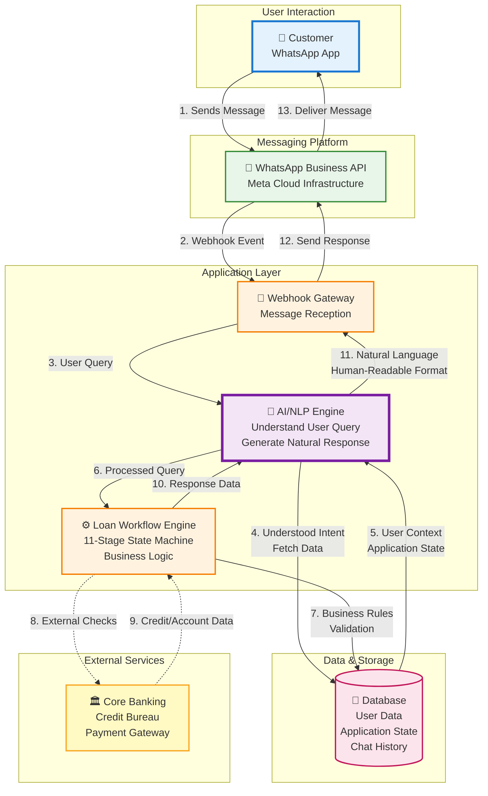

# High-Level System Architecture
## WhatsApp-Based Digital Lending Platform

## Simplified End-to-End Flow

## System Components Overview

### 1. **User Interaction Layer**
- Customers interact via WhatsApp mobile app
- No app download required
- 2.5B+ global user base

### 2. **Messaging Platform**
- Meta WhatsApp Business API
- Enterprise-grade messaging infrastructure
- Secure message routing and delivery

### 3. **Application Layer**

#### **Webhook Gateway**
- Receives messages from WhatsApp
- Handles webhook verification
- Routes messages to processing layer

#### **AI/NLP Engine** ⭐
- **Natural Language Understanding**: Interprets user queries and intent
- **Context Management**: Maintains conversation context
- **Data Retrieval**: Fetches relevant information from database
- **Response Generation**: Converts structured data into human-readable natural language

#### **Loan Workflow Engine**
- 11-stage state machine for loan lifecycle
- Business rule validation
- Application state management
- Integration with external services

### 4. **Data & Storage**
- User profiles and application data
- Conversation history and context
- Application state tracking
- Complete audit trail

### 5. **External Services**
- Core banking system integration
- Credit bureau APIs (CIBIL, Experian)
- Payment gateway for transactions
- Document verification services

## Key Flow Steps

1. **Customer sends message** via WhatsApp
2. **WhatsApp API** forwards message via webhook
3. **Webhook Gateway** receives and routes message
4. **AI/NLP Engine** understands user intent and query
5. **Database** provides user context and application state
6. **AI/NLP Engine** processes query with context
7. **Workflow Engine** executes business logic and validation
8. **External Services** provide credit checks, account verification
9. **Workflow Engine** generates response data
10. **AI/NLP Engine** converts data to natural language
11. **Response delivered** back to customer via WhatsApp

## Key Features

✅ **AI-Powered Conversations**: Natural language understanding and generation
✅ **State Management**: 11-stage loan workflow with context persistence
✅ **Enterprise Integration**: Seamless connection with banking systems
✅ **Scalable Architecture**: Handles thousands of concurrent conversations
✅ **Complete Lifecycle**: From application to disbursal to repayment

---

*This high-level architecture demonstrates a production-ready, enterprise-grade conversational banking platform with intelligent AI-powered natural language processing.*

